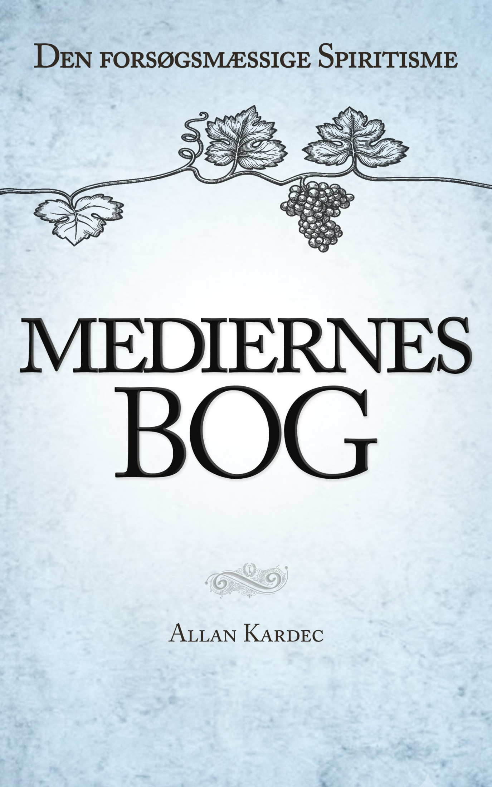

# Mediernes E-bog
The Mediums Book formatted for e-book including cover - in danish language.

Formatted in Microsoft Word.

E-pub conversion and chapters are made in Calibre.

Cover made in Photoshop.

Feel free to use, distribute or translate the work.

### Physical copy
Support the work and buy the physical copy of the book here: 
https://kardec.dk/books/ws-/products/mediernes-bog

### Credits

Forfatter: Allan Kardec (1804-1869) 
3. danske udgave København, 2017, 1. oplag 
**Original titel:** Le livre des Médiums 
Udgivet første gang i Paris, Frankrig, 1861

Digitalisering af den danske udgave fra 1904: Vera Lucia Borges Palmgren
Modernisering af sproget og revision: Jette B.B. Andersen og Sonia Regina de Araujo 
**Opsætning:** Balle Grafik 
**Omslag:** Vivianne Guillaumon Thomsen

Baseret på 2. danske udgave oversat af Cand.Mag. Sigurd Trier efter franske udgaves 36.oplag, udgivet af V. Pio’s Boghandel, 1904

**Copyright:** Spiritist Forening Allan Kardec GEEAK-DK

**Trykt hos:** Scandinavian Books

**ISBN:** 978-87-997389-1-5

**E-bog:** version 1.0 (juni 2026) 
**Omslag & opsætning:** Simon Sessingø, simon.sessingoe@gmail.com 

http://www.kardec.dk 
mail@kardec.dk

# License

This work (including .epub files, Word documents, and .psd cover designs) is licensed under a **Creative Commons Attribution-NonCommercial 4.0 International License (CC BY-NC 4.0)**.

### This means you are free to:
* **Share:** Copy and redistribute the material in any medium or format.
* **Adapt:** Remix, transform, and build upon the material.

### Under the following terms:
* **Attribution (BY):** You must give appropriate credit, provide a link to the license, and indicate if changes were made. You may do so in any reasonable manner, but not in any way that suggests the licensor endorses you or your use.
* **NonCommercial (NC):** You may **NOT** use the material for commercial purposes (i.e., you cannot sell or make money off of this work).

---

The full legal code of the license can be found at: 
https://creativecommons.org/licenses/by-nc/4.0/